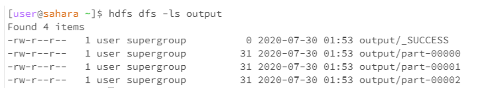

Test with multiple reducers

Here, we use the same problem as the previous slide on "Working with CSV" for an example. 

It is worth noting that:
- To run the python codes with Hadoop Streaming, you need to add #!/usr/bin/python in the top line of your *.py files. 
This tells Hadoop where to find the python interpreter.
- We changed both mapper.py and reducer.py , the previous codes are in the comments.
- In this test the mapper outputs <salary, null> as the <key,value> pair.
- When using Hadoop Streaming, by default, *the prefix of a line up to the first **tab character*** (\t) is the key and the 
rest of the line (excluding the tab character) will be the value. If there is no tab character in the line, then the 
entire line is considered as key and the value is null. More details can be found here.

Now, let's start the test!
## Preparation

We need to copy the file empolyees.csv into HDFS.

```$ hdfs dfs -mkdir -p /user/user```

```$ hdfs dfs -mkdir /user/user/input```

```$ hdfs dfs -put employees.csv /user/user/input```

## Running the job with a single Reducer

Run the MapReduce job:

```$ hadoop jar $HADOOP_HOME/share/hadoop/tools/lib/hadoop-streaming-*.jar -file ~/mapper.py -mapper ~/mapper.py -file ~/reducer.py -reducer ~/reducer.py -input input -output output```

List the content of the output folder:

```$ hdfs dfs -ls output```

Then, you will find that the reducer outputs the result in a file named 'part-00000'.

Show the content of the file 'part-00000':
```$ hdfs dfs -cat output/part-00000```

You will get the correct answer: The maximum salary is $ 24000

## Running the job with 3 Reducers

We should first remove the output folder before doing the next test.

```$ hdfs dfs -rm -r output```

To run the job with three reducers, we should add the setting -numReduceTasks 3 to the command, and we have:

```$ hadoop jar $HADOOP_HOME/share/hadoop/tools/lib/hadoop-streaming-*.jar -file ~/mapper.py -mapper ~/mapper.py -file ~/reducer.py -reducer ~/reducer.py -numReduceTasks 3 -input input -output output```

This time, you will find that there are three output files in the output folder (part-00000, part-00001 and part-00002), 
one for each reducer.

```$ hdfs dfs -ls output```



To show the contents of these three files together:

```$ hdfs dfs -cat output/part-*```

You will find that there are three lines, and only one has the correct answer. However, we just want to get one line 
output as the final result (Imagine that we have 1000 reducers, it is not a good idea to find the maximum value within 
1000 possible output files). Therefore, this job fails in this case.

**Next**, you can modify the current codes back to the previous slide, test it with 3 reducers and compare the results. 
What can you find? :)

## Why does 'running the job with a single Reducer' work?

Although the mapper output many <key, value> pairs with different keys, all the <key, value> pairs are allocated to the 
same reducer (because there is only one reducer). Therefore, the reducer can get the maximum salary of employees.

In a distributed computing scenario, it is common to have multiple reducers. Therefore, we have to consider this case 
when designing our mapper and reducer programs.