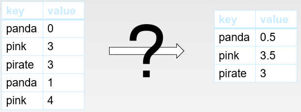
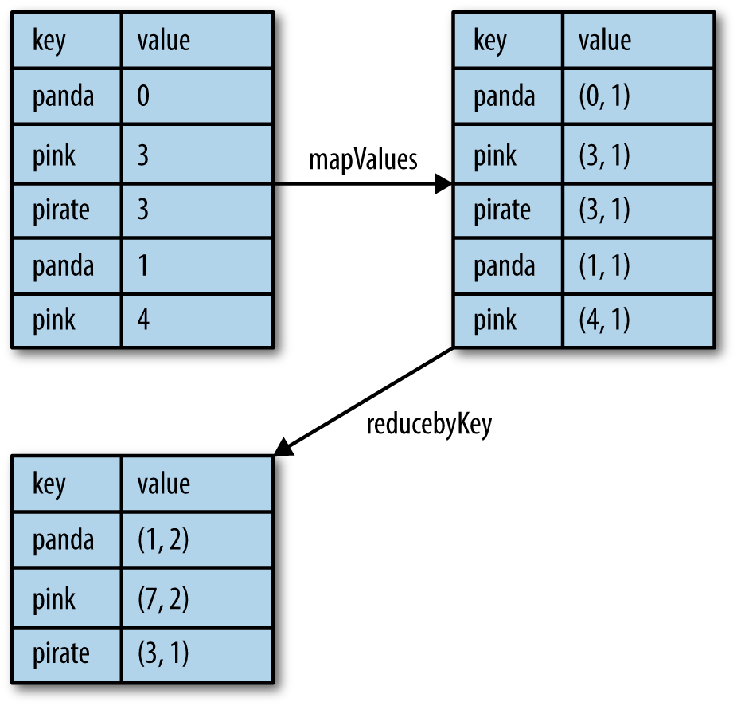

# Try it: per-key average (pair RDD)
When datasets are described in terms of key/value pairs, it is common to want to aggregate statistics across all 
elements with the same key. Spark has a similar set of operations that combines values that have the same key. 
These operations return RDDs and thus are transformations rather than actions. Let's use an example of computing 
per-key average to practice pair RDD operations.

Given a dataset in which each key is associated with a value, your task is to compute the average value for each key. 
That is, the total value with this key divided by the occurrence of the key.

How can you use Spark to obtain the output for the given input as shown in the above figure?

First, use the following command to create a pair RDD from the file "KVP.txt":

`textfile = sc.textFile("file:///home/KVP.txt")`

`pair = textfile.map(lambda s: (s.split()[0],  s.split()[1]))`

Please open the pyspark shell and complete the remaining steps to compute the average value for each key. If you get 
stuck, please see the hints as shown in the below figure:

