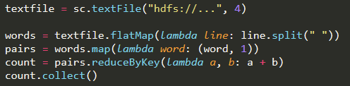
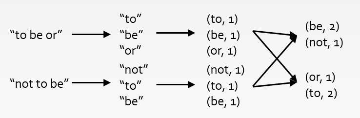
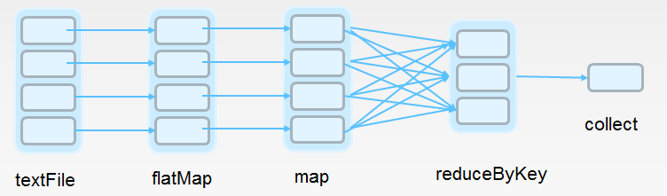
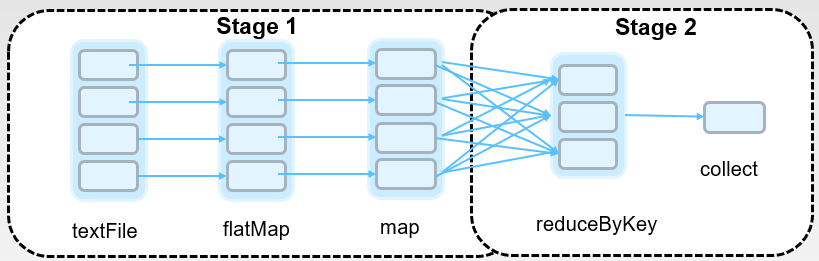

# How Spark does word count

We further demonstrate how Spark solves big data problems using a word count example. 
The Spark code is like below:

Here is a diagram of the transformations and actions we have performed to get the word frequencies

Now, lets look at the code line by line.

**1. textfile = sc.textFile("hdfs://...")**

We have learned that `textFile()` is a transformation operation to load file from disk to memory. 
Here we see one more parameter, the number of *partitions*, which tells Spark how many for 
parallel collections to cut the dataset into. Spark will run one task for each partition of 
the cluster. Typically, you want 2-4 partitions for each CPU in your cluster. Normally, Spark 
tries to set the number of partitions automatically based on your cluster. However, you can 
also set it manually by passing it as a second parameter to `paralellize` (like shown in the 
word count example)

**2. words = text.flatMap(lambda line: line.split())**

`flatMap` is a transformation operation. `map(func)` returns a new distributed dataset formed 
by passing each element of the source through a function *func*. `flatMap(func)` is similar to 
map, but each input item can be mapped to 0 or more output items (so *func* should return a 
sequence rather than a single item) 

**3. pairs = words.map(lambda word:(word, 1))**

This is similar to what we have done using MapReduce. We transform each word into a pair.

**4. count = pairs.reduceByKey(lambda a, b: a + b)**

`pairs` stores the key-value pairs for each word appearing in the file. We call such an RDD 
the "**pair RDD**", and we will practice more on pair RDDs in a later slide. `reduceByKey(func)` 
is a transformation operation which is similar to what we have done using MapReduce. This would 
cause data shuffling across different partitions. Spark will group the key-value pairs according 
to the keys, and then apply `func` over the values to compute a results for each key.

**5. count.collect()**

This is an action operation, and this incurs all previous operations (such as loading the file)

Spark will create an execution plan based on your code. The scheduler examines build a DAG 
(directed acyclic graph) of stages. Stages are sequences of RDDs, that don't have a `Shuffle()` 
in between. The boundaries are the shuffle stages. For the word count example, two stages would 
be created like below:

in each stage, the operations will run in parallel for different RDD partitions.