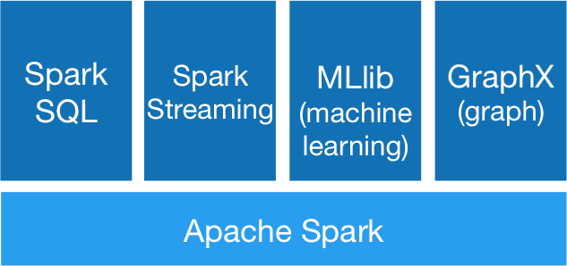
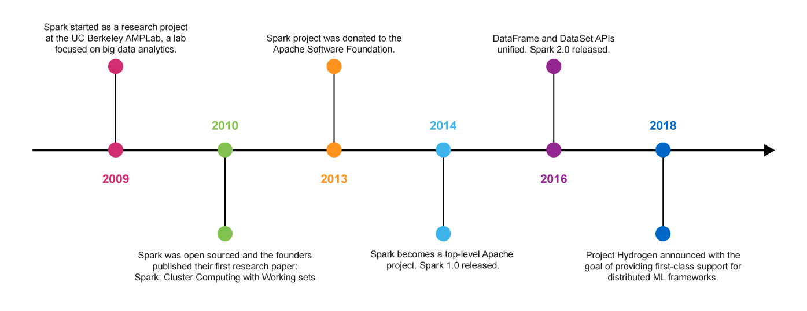
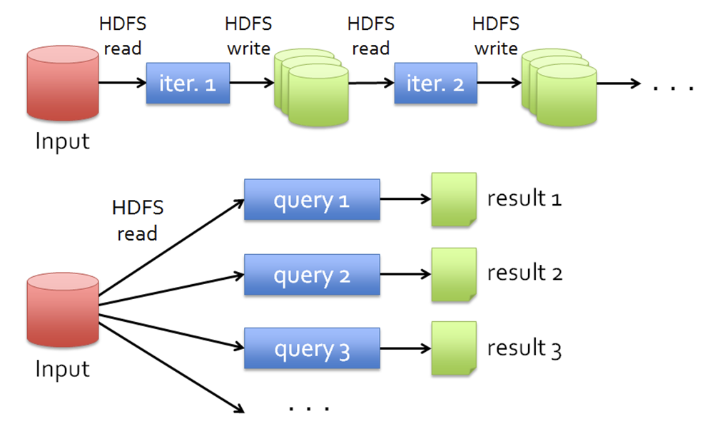
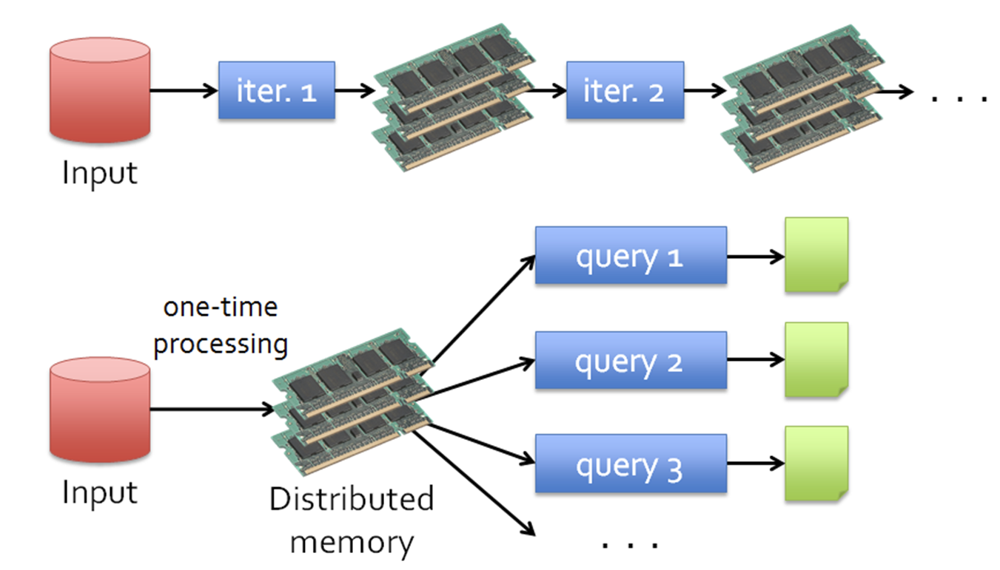
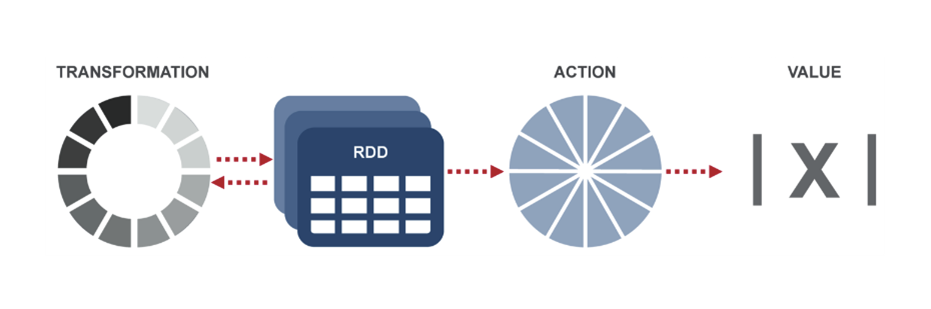
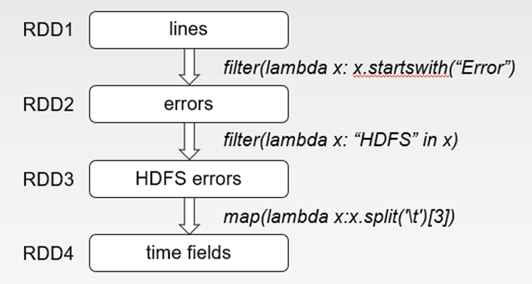
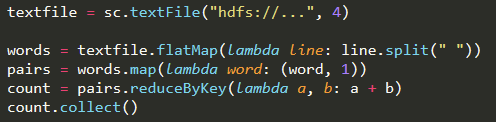
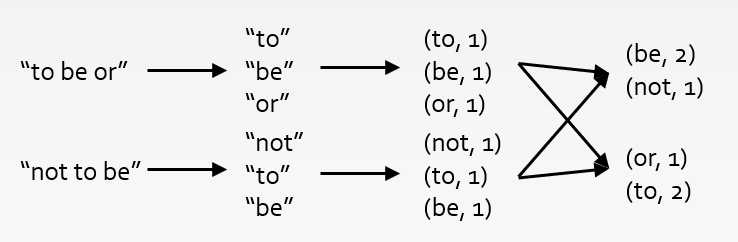
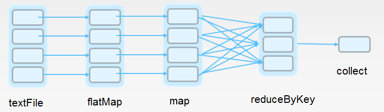
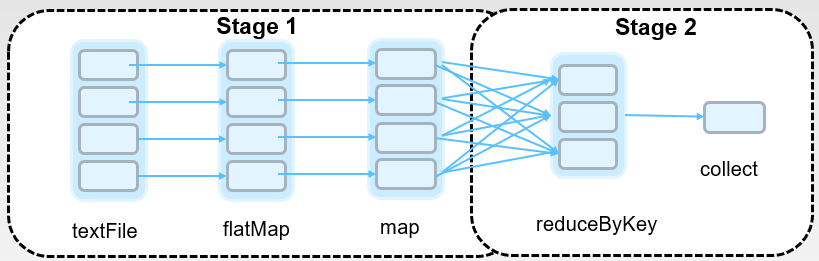

# Introduction
One drawback of MapReduce is that it relies on node computers frequently reading and writing data from their disks. In the map phase, 
data is read from disk, processed, and the results are written back to disk. In the reduce phase, these intermediate results are read 
from disk, aggregated, and the final result is written back to disk. This reading and writing is very slow. If your job requires two 
or more iterations of mapping and reducing then the problem is even worse.

To avoid this problem a piece of software called **Spark** has been developed. Spark still uses Hadoop and YARN to access data stored in 
a cluster (although it has its own versions of these if you'd prefer to use them). But it provides a way of working with that data 
that relies much less on disk reading and writing, by keeping data in node RAM instead. This makes Spark much faster than MapReduce, 
especially if the mapper and reducer functions need to be called iteratively. Spark is up to 100 times faster when all of the data 
is kept in memory, but still up to 10 times faster when it has to resort to disk. 

You can execute Spark commands directly, or you can execute them by writing programs in Java, Python, or Scala. You will learn how 
to do so in Python, using Python's **pyspark** library.

# Spark Components
Spark also has a rich set of higher-level tools for performing special kinds of tasks: querying data SQL-style (**Spark SQL**), processing 
streaming data (**Spark Streaming**), processing graph data (**GraphX**), and doing machine learning (**MLLib*).



### Spark Core
The Spark Core is the underlying general execution engine for Spark that all other functionality is built upon. 

### Spark SQL
Spark SQL is a component on top of Spark Core for processing structured data. With Spark SQL, you can use your knowledge of SQL to 
work with big data.

### Spark Streaming
Spark Streaming uses Spark Core’s fast processing speed to work with live data streams. Many organisations (such as in Twitter) have 
to work with large volumes of streaming data.

## MLlib
MLlib is Spark’s machine learning (ML) library, whose goal is to make machine learning practical and easy. It provides APIs to support 
many machine learning tasks, such as classification, regression, clustering, feature extraction, dimensionality reduction, and so on.

## GraphX
GraphX is a component of Spark for working with graphs.

## History
Spark was developed at the University of California, Berkeley campus AMPLab in 2009. It was open-sourced in 2010 and then donated to the 
Apache Software Foundation in 2013.

In February 2014, Spark became a top-level Apache project and Spark 1.0 was released. In November 2014, Spark founder M. Zaharia's 
company Databricks set a new world record in large scale sorting using Spark.

In 2016, Spark 2.0 was released with a new Dataset object whose use is encouraged over the original RDD object.

Currently, Spark is one of the most active projects in the Apache Software Foundation and one of the most active open source big data projects. 



# Why Spark?
In weeks 4 and 5, we have learned Hadoop MapReduce. Then, why we need to learn a new tool in this week?

The reason is: MapReduce has some limitations. MapReduce greatly simplified big data analysis on large, unreliable clusters, but it is 
only great at one-pass computation. Think about the following tasks:
- More complex jobs that require multi-pass analytics. For example, machine learning algorithms (such as K-Means clustering) or graph 
algorithms (such as shortest path computation)
- More interactive ad-hoc queries (such as SQL-like queries)
- More real-time stream processing (such as finding the most frequent items in the transactions of the past week).
All such tasks require huge data shared across different nodes in a cluster in multiple round jobs. However, data sharing is very 
inefficient in MapReduce, since it is based on HDFS.



As shown in the Figure, multiple round MapReduce jobs need to frequently read data from and write data to HDFS. For processing different 
queries, each time MapReduce has to read the data from HDFS once and scan the data from the beginning to the end. 

MapReduce has utilized the CPUs and hard drives in the cluster for distributed computation. What has not been utilized so far? 
The answer is: **memory**!

Hence, Spark aims to keep more data in-memory to improve the performance! In Spark, the data sharing is through memory rather than HDFS, 
and thus is much more efficient, as shown below:



Note that Spark is not a modified version of Hadoop. It is dependent on Hadoop because it has its own cluster management. Spark uses Hadoop 
for storage purpose only (Spark can also use the local disk for storing data).

# RDD and RDD operations
In Spark, you work with **Resilient Distributed Datasets (RDDs)**. An RDD is a collection of data items. Each data item can 
be any type of Python, Java, or Scala object, including user-defined classes. It is **resilient**, because it is 
fault-tolerant - Spark automatically recomputes missing or damaged data when a node fails. It is **distributed**, because 
this data is kept on multiple nodes across a cluster. As much as possible the data in an RDD is stored in memory.

RDD has the following traits:
- **In-Memory**: data inside an RDD is stored in memory as much (size) and as long (time) as possible.
- **Immutable or Read-Only**: it does not change once created and can only be transformed using transformations 
to new RDDs.
- **Lazy evaluated**: the data inside RDD is not available or transformed until an action is executed that triggers 
the execution.
- **Cacheable**: you can hold all the data in a persistent storage, like memory (default and the most preferred) or 
disk (the least preferred due to access speed).
- **Parallel**: process data in parallel.
- **Typed**: values in an RDD have types, for example, RDD[Long] or RDD[(Int, String)].
- **Partitioned**: the data inside an RDD is partitioned (split into partitions) and then distributed across nodes in a 
cluster (one partition per JVM that may or may not correspond to a single node).

## Operating on an RDD
Spark uses RDD to manage the data. There are two types of operations you can perform on an RDD: **transformations** and 
**actions**. A transformation creates a new RDD from an existing RDD. An action performs a computation on the RDD and 
returns the result. The idea can be shown as the below figure.



The best way to see how the transformations and actions work is to see them in action, and we will be going through a 
number of examples. But here is a list of the most important ones:

## Transformations

A transformation creates a new RDD from an existing one. Here are some commonly used ones:

`rdd.distinct()` 

Returns a new RDD that contains the distinct elements of `rdd`.

`rdd.filter(func)` 

Returns a new RDD obtained by applying func to each element of rdd, keeping elements that return true and discarding 
elements that return false.

`rdd.map(func)` 

Returns a new RDD obtained by applying func to each element of `rdd`.

`rdd.flatMap(func)` 

Similar to `map()`, but `func`  can return multiple items.

`rdd.sortByKey()`

Only for pair RDDs. Returns a new RDD with the same <key, value> pairs but sorted with the keys in ascending order 
(use `sortByKey(false)` for descending order).

`rdd.groupByKey()` 

Only for pair RDDs. Groups all values for the same key into a collection `values` and returns a new RDD with of 
<key, values> pairs.

`rdd.reduceByKey(func)` 

Only for pair RDDs. Uses func to reduce all values for the same key to a single value total and returns a new RDD of 
<key, total> pairs.

More transformation operations can be found at: https://spark.apache.org/docs/latest/rdd-programming-guide.html#transformations.

# Actions
An action performs a computation on the RDD and returns the result. Here are some commonly used ones:

`rdd.count()`

Returns the number of items in `rdd`.

`rdd.countByValue()` 

Only for pair RDDs. Returns the number of each value in `rdd`. 

`rdd.countByKey() `

Only for pair RDDs. Returns the number of each key in `rdd`. 

`rdd.first()`

Returns the first element of `rdd`.

`rdd.take(n)`

Returns the first n elements of `rdd` as an array. `take(1)` is equivalent to `first()`.

`rdd.collect()`

Returns all the elements of `rdd` as an array.

`rdd.saveAsTextFile(path)`

Saves `rdd` as a text file to HDFS at the location path.

`rdd.reduce(func)` 

Aggregates the elements of `rdd` using `func`. Because the computations occur in parallel, func must be commutative and associative.

More action operations can be found at: https://spark.apache.org/docs/latest/rdd-programming-guide.html#actions. 

We will practice the transformation and action operations in some examples later.

# Further reading:

1. RDDs were first proposed in the following paper: Zaharia, M., Chowdhury, M., Das, T., Dave, A., Ma, J., 
McCauley,…Stoica, I. (2012). Resilient distributed datasets: A fault-tolerant abstraction for in-memory 
cluster computing. Proceedings of the 9th USENIX Conference on Networked Systems Design and Implementation, 
San Jose, CA.

2. More detailed RDD programming guide can be found from the Spark's official website: 
https://spark.apache.org/docs/latest/rdd-programming-guide.html 

3. Learning Spark, first edition. More examples on Spark RDD programming.

# Creating an RDD
Spark provides a special kind of object, a **SparkContext**, which has the properties and methods that you need to work 
with RDDs. Later you will see how to create a SparkContext in Python. In the rest of this slide we will assume that 
a SparkContext has been created, called sc.  SparkContext is the entry point to Spark for a Spark application. Once 
a SparkContext instance is created, you can use it to
- Create RDDs
- Create accumulators
- Create broadcast variables
- Access Spark services and run jobs

Spark provides two ways to create an RDD.

## Using parallelize()

You can use this to create an RDD from a Python object. Here's an example in Python:

```
data = [1, 2, 3, 4]
numbers = sc.parallelize(data)
```

In this example we create a Python list called "data", and then we pass it to the `parallelize()` method of sc, the 
SparkContext object.

This is very useful when you're learning Spark, since you can quickly create your own RDDs. However, it's not widely 
used in real tasks since it requires that you have your entire dataset in memory on one machine (for most big data 
problems your memory is not enough to hold all the data).

## Using textFile()
This is a much more common way to create an RDD. Suppose that you have a text file stored in the home folder of your 
local file system, called "text.txt". You can, using Python, create an RDD as follows:

`lines = sc.textFile("file:///home/text.txt")`

You can also create an RDD from a file stored in HDFS. We will practice creating RDDs in later slides.

# Lazy evaluation

One of the features that makes Spark fast is that transformations on RDDs are **lazily evaluated**, which means that 
Spark will not execute any of them until it sees an action. When we call a transformation on an RDD the operation is 
not immediately performed. Instead, Spark remembers that this transformation has been requested. So, rather than 
thinking of an RDD as containing specific data, it is best to think of each RDD as consisting of instructions on how 
to compute the data that we build up through transformations. When an action operation is called on an RDD object, 
all the transformations are then performed and the resulting value is returned.

For example, assume that a web service is experiencing errors and operators want to search terabytes of logs in the 
Hadoop file system to find the cause. Consider the following Spark command:

```
lines = sc.textFile("hdfs://…") //base RDD, obtained from a file on HDFS
errors = lines.filter(lambda x: x.startswith("Error")) //get messages that start with "Error", "errors" is a transformed RDD
errors.persist() //persist the data in memory
errors.count()
errors.filter(lambda x: "HDFS" in x).map(lambda x:x.split('\t')[3]).collect()
```

The code would generate four RDDs, as shown below:



Since filter() and map() are transformation operations, Spark does not perform any computations until it sees the 
action operation collect(), and only then are the executions are started. Loading data into an RDD is also lazily 
evaluated, since it is a transformation operation as well. So, when we call sc.textFile("hdfs://…"), the data is 
not loaded from HDFS until it is necessary (i.e. an action operation is applied to the data). 

To explain the code line by line:
- Line 1: loads RDD from an HDFS file (base RDD “lines” not loaded in memory at this stage).
- Line 2: filter out lines that are not about error messages, and only keep lines starting with "Error".
- Line 3: asks for “errors” to persist in memory (“errors” are in RAM, will explain later)
- Line 4: counts the number of error messages in the error RDD.
- Line 5: assume that the operators first are going to find out the time when HDFS errors happened, which is 
recorded in the fourth field of the error message. This line of code first get all the error messages relevant 
to "HDFS", and then split the text message and get the error time information field. All the execution will happen 
at this line, when the "collect()" operation is seen by Spark.

Lazy evaluation allows Spark to reduce the number of passes it has to take over the data by grouping operations 
together. In systems like Hadoop MapReduce, developers often have to spend a lot of time considering how to group 
together operations to minimize the number of MapReduce passes. In Spark, there is no substantial benefit to writing 
a single complex map instead of chaining together many simple operations. Thus, users are free to organize their 
program into smaller, more manageable operations.

# Persisting an RDD
One of the most important capabilities in Spark is persisting (or caching) an RDD in memory across operations. When 
you persist an RDD, each node stores its part of the RDD. You can reuse the RDD in other actions on that dataset.

You can persist an RDD by calling the `persist()` method on it:
`rdd.persist()`

By default, the RDD is stored in memory only - if the RDD does not fit into memory then some parts of it will not be 
persisted and will be recomputed when they're needed. You can also specify that you'd like Spark to use memory and 
disk - If the RDD does not fit in memory then some parts of it will be stored on disk and read them from there when 
they're needed. You do this as follows:

`rdd.persist(StorageLevel.MEMORY_ONLY)`

### Why persist an RDD?
Consider the example in the previous slide again, if we do like:

```
lines = sc.textFile("hdfs://…")
errors = lines.filter(lambda x: x.startswith("Error"))
errors.count()
errors.filter(lambda x: "HDFS" in x).map(lambda x:x.split('\t')[3]).collect()
```

When you call `errors.count()`, the file is loaded, and the transformations and actions are performed, and then 
errors is released in memory. When you next call `errors.filter(...)`, the whole process happens again in order to 
obtain the RDD errors.

### Contrast this with the following code:

```
lines = sc.textFile("hdfs://…")
errors = lines.filter(lambda x: x.startswith("Error"))
errors.persist()
errors.count()
errors.filter(lambda x: "HDFS" in x).map(lambda x:x.split('\t')[3]).collect()
```

As in the first example, when you call errors.count(), the file is loaded, and the transformations and actions are 
performed. But when next you call errors.filter(...), since errors has been kept in memory already, it is not needed 
to load the file and compute for it again.

# How Spark does word count
We further demonstrate how Spark solves big data problems using a Word Count example. The Spark code is like below:



Here is a diagram of the transformations and actions we have performed to get the word frequencies:





Next, let's look at the code line by line.

1. `textfile = sc.textFile("hdfs://...", 4)`
We have learned that textFile() is a transformation operation to load file from disk to memory. Here we see one more 
parameter, the number of partitions, which tells Spark how many for parallel collections to cut the dataset into. 
Spark will run one task for each partition of the cluster. Typically you want 2-4 partitions for each CPU in your 
cluster. Normally, Spark tries to set the number of partitions automatically based on your cluster. However, you 
can also set it manually by passing it as a second parameter to parallelize (like shown in the word count example). 

2. `words = text.flatMap(lambda line: line.split())`
flatMap is a transformation operation. map(func) returns a new distributed dataset formed by passing each element 
of the source through a function func. flatMap(func) is similar to map, but each input item can be mapped to 0 or 
more output items (so func should return a sequence rather than a single item). In one sentence, this line converts 
the RDD containing the "lines" into an RDD containing the "words". We can see the difference between them in the 
next slide.

3. `pairs = words.map(lambda word: (word, 1))`
This is similar to what we have done using MapReduce. We transform each word into a pair.

4. `count = pairs.reduceByKey(lambda a, b: a+b)`
`pairs` stores the key-value pairs for each word appearing in the file. We call such an RDD the **"pair RDD"**, and  
we will practice more on pair RDDs in a later slide. `reduceByKey(func)` is a transformation operation which is similar 
to we have done using MapReduce. This would cause data shuffling across different partitions. Spark will group the 
key-value pairs according to the keys, and then apply `func` over the values to compute a result for each key. 

5. `count.collect()`
This is an action operation, and this incurs all previous operations (such as loading the file). Spark will create 
an execution plan based on your code. The scheduler examines build a DAG (directed acyclic graph) of stages. 
Stages are sequences of RDDs, that don’t have a Shuffle in between. The boundaries are the shuffle stages. For 
the word count example, two stages would be created like below:



In each stage, the operations will run in parallel for different RDD partitions.

# Further Resources
1. The official Spark website is a good source of further information about Spark: Official Spark website 
https://spark.apache.org/docs/latest/

2. Hadoop vs Spark: https://youtu.be/2PVzOHA3ktE

3. More examples of using Spark RDDs: https://youtu.be/ou0MYgLnftg

# Week 5 Content:
- spark in a python shell
- map() vs flatmap()
- pair RDDs
- try it: per-key average
- spark in a python program
- try it: the longest word
- try it: word average length
- passing functions to spark
- try it: top-k most frequent pairs
- example: using csv data
- try it: inner join of two tables (CSV data)
- try it: top-k users (CSV data) 
