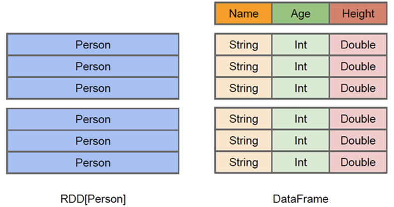

# DataFrames and SQL

The latest versions of Spark include a new kind of object called a DataFrame, 
which is an RDD with some extra structure some extra functionality.

A DataFrame is still a collection of items but those items are special Row objects, 
which have more structure. This makes working a DataFrame a lot like working with 
a table.

DataFrame is more like a traditional database of two-dimensional form, in 
addition to data, but also to grasp the structural information of the data, 
that is, the schema. Let's use an example to see the difference between DataFrame 
and RDD:



- RDD[Person] although with Person for type parameters, but the Spark framework 
itself does not understand internal structure of the Person class.
- DataFrame has provided a detailed structural information, making Spark SQL
can clearly know what columns are included in the dataset, and what is the name 
- and type of each column. Thus, Spark SQL query optimizer can target optimization.

In fact, Spark allows us to use SQL to query the data in a DataFrame. We'll see 
that is done in the next slide.

# Views in Spark SQL
As shown in the previous slide, we use createOrReplaceTempView() to create a view. 
In addition to creating tables, Spark can create views on top of existing tables. 
Views can be global (visible across all SparkSessions on a given cluster) or 
session-scoped (visible only to a single SparkSession), and they are temporary: 
they disappear after your Spark application terminates.

Creating views has a similar syntax to creating tables within a database. Once 
you create a view, you can query it as you would a table. The difference between 
a view and a table is that views don’t actually hold the data; tables persist after 
your Spark application terminates, but views disappear.

You can create a view from an existing table using SQL. For example, if you wish 
to work on only the subset of the US flight delays data set with origin airports 
of New York (JFK) and San Francisco (SFO), the following queries will create global 
temporary and temporary views consisting of just that slice of the table:
```
# In SQL
CREATE OR REPLACE GLOBAL TEMP VIEW us_origin_airport_SFO_global_tmp_view AS
    SELECT date, delay, origin, destination from us_delay_flights_tbl WHERE origin = 'SFO';
CREATE OR REPLACE TEMP VIEW us_origin_airport_JFK_tmp_view AS
    SELECT date, delay, origin, destination from us_delay_flights_tbl WHERE origin = 'JFK'
```

You can accomplish the same thing with the DataFrame API as follows:

```
# In Python
df_sfo = spark.sql("SELECT date, delay, origin, destination FROM us_delay_flights_tbl WHERE origin = 'SFO'") 
df_jfk = spark.sql("SELECT date, delay, origin, destination FROM us_delay_flights_tbl WHERE origin = 'JFK'")

# Create a temporary and global temporary view
df_sfo.createOrReplaceGlobalTempView("us_origin_airport_SFO_global_tmp_view") 
df_jfk.createOrReplaceTempView("us_origin_airport_JFK_tmp_view")
```

Once you’ve created these views, you can issue queries against them just as 
you would against a table. Keep in mind that when accessing a global temporary 
view you must use the prefix `global_temp.<view_name>`, because Spark creates 
global temporary views in a global temporary database called `global_temp`.

By contrast, you can access the normal temporary view without the global_temp prefix:
```
# In SQL
SELECT * FROM us_origin_airport_JFK_tmp_view

# In Python
spark.read.table("us_origin_airport_JFK_tmp_view")

# Or
spark.sql("SELECT * FROM us_origin_airport_JFK_tmp_view")
```

You can also drop a view just like you would a table:
```
# In SQL
DROP VIEW IF EXISTS us_origin_airport_SFO_global_tmp_view;
DROP VIEW IF EXISTS us_origin_airport_JFK_tmp_view

# In Python
spark.catalog.dropGlobalTempView("us_origin_airport_SFO_global_tmp_view")
spark.catalog.dropTempView("us_origin_airport_JFK_tmp_view")
```

