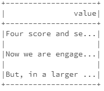

# Working with Text Files (Word Count)
We have used RDD to the word count problem in a document. Now let's look at 
how to do it by using DataFrame APIs and Spark SQL.

First, we need to use the DataFrame API to read the text file. Spark SQL 
provides spark.read().text("file_name") to read a file or directory of text 
files into a Spark DataFrame, and dataframe.write().text("path") to write 
to a text file. When reading a text file, each line becomes each row that 
has string “value” column by default.

In pyspark, first let's load the file into a DataFrame object and filter 
out the empty lines by:

```
fileDF = spark.read.text("file:///home/text.txt")
fileDF = fileDF.filter(fileDF.value != "")
```

If you use the `show()` function to display the contents of fileDF, you will see:


Next, we need to use Spark SQL explode() and split() to convert the lines into 
words:

```
from pyspark.sql.functions import *
wordDF = fileDF.select(explode(split(lower(fileDF.value), ' ')).alias("word"))
```

Then, we can use DataFrame's `groupBy()` and `count()` functions to compute 
the word frequencies:

`countDF = wordDF.groupBy("word").count()`

If we want to sort the result by the words, we can further use the DataFrame's 
`orderBy()` function:

```
sortedDF = countDF.orderBy("word") 
# or
sortedDF = countDF.orderBy(countDF.word) 
```

You can use the `show()` function to display the data in sortedDF, or you can 
store the results in a local file. However, if you need to write to a text 
file, you must combine all columns into a single column first by using the 
concat() function (here we use ":" as the separator by using the lit() function).

`ssortedDF.select(concat(col("word"),lit(':'),col("count")).cast("string")).write.format("text").mode("append").save("file:///home/output")`